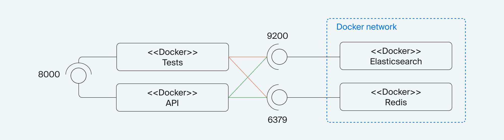
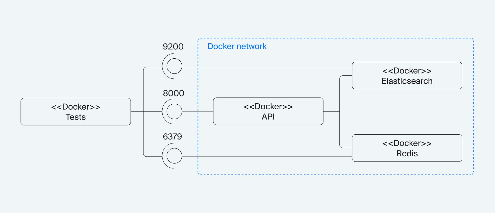
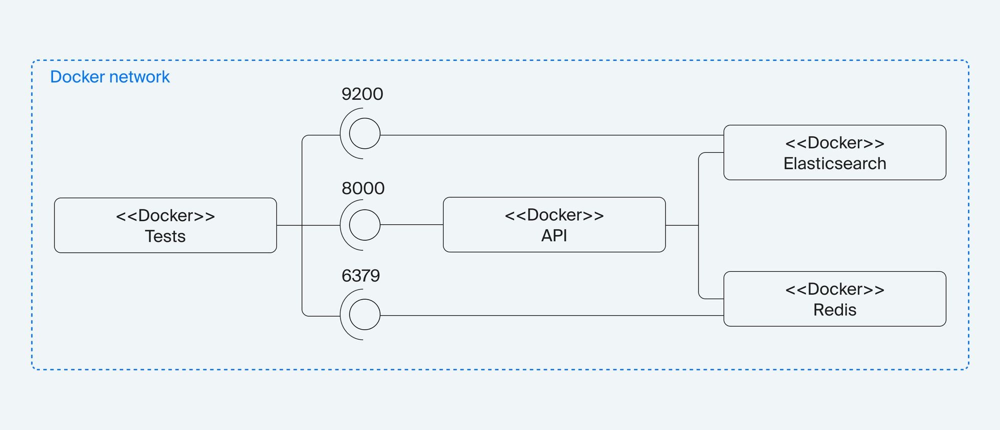

# Асинхронный API кинотеатра на FastAPI

Окружение для работы сервиса в проекте [fastapi_environment](https://github.com/askalach/fastapi_environment)

## Тесты
Функциональные тесты находятся в папке [tests/functional](tests/functional/)

Тесты написаны с использованием библиотек `pytest` и `aiohttp`.

Файл [docker-compose.yml](tests/functional/docker-compose.yml) обеспечивает сборку тестового окружения

```yaml
version: "3.9"
services:
  es:
    container_name: es
    image: elasticsearch:8.1.2
    env_file:
      - .env
    environment:
      - discovery.type=single-node
      - node.name=${COMPOSE_PROJECT_NAME}_01
      - cluster.name=${COMPOSE_PROJECT_NAME}
      - "ES_JAVA_OPTS=-Xms128m -Xmx128m"
      - xpack.security.enabled=false
    ports:
      - 9200:9200
  redis:
    env_file:
      - .env
    container_name: redis
    image: redis:6.2.6
    healthcheck:
      test: [ "CMD", "redis-cli", "--raw", "incr", "ping" ]
    ports:
      - 6379:6379
  api:
    build:
      context: ../../
      dockerfile: Dockerfile
    env_file:
      - .env
    container_name: api
    ports:
      - 8000:8000
    depends_on:
      - es
      - redis
  test:
    build:
      context: .
      dockerfile: Dockerfile
    env_file:
      - .env
    container_name: api
    depends_on:
      - es
      - redis
    entrypoint: >
      sh -c "pip install -r /tests/functional/requirements.txt && python3 /tests/functional/utils/wait_for_es.py && python3 /tests/functional/utils/wait_for_redis.py && pytest /tests/functional/src"
```

Из Docker транслируется три порта в локальную сеть:
* 8000-й — для приложения,
* 9200-й — для Elasticsearch,
* 6379-й — для Redis.

Это позволяет делать следующее:
1. Запускать локально сервис и тесты, чтобы производить дебаг кода.

2. Запускать локально тесты, чтобы проверять работу всего приложения в рамках Docker-контейнера.

3. Запускать тесты и приложение изолированно в рамках Docker-compose.


### Настройка тестов
В папке [tests/functional](tests/functional/) создать файл .env на основе [tests/functional/.env.example](tests/functional/.env.example)

### Тесты покрывают
1. [Функциональные тесты для метода /search](tests/functional/src/test_search.py):
* все граничные случаи по валидации данных;
* вывод N записей;
* поиск записи или записей по фразе;
1. [Функциональные тесты для метода /film](tests/functional/src/test_film.py):
* все граничные случаи по валидации данных;
* поиск конкретного фильма;
* вывести все фильмы;
* вывести фильмы жанра;
* поиск с учётом кеша в Redis.
3. [Напишите функциональные тесты для метода /person](tests/functional/src/test_person.py):
* все граничные случаи по валидации данных;
* поиск конкретного человека;
* поиск всех фильмов с участием человека;
* поиск с учётом кеша в Redis.
1. [Напишите функциональные тесты для метода /genre](tests/functional/src/test_genre):
* все граничные случаи по валидации данных;
* поиск конкретного жанра;
* вывести все жанры;
* поиск с учётом кеша в Redis.